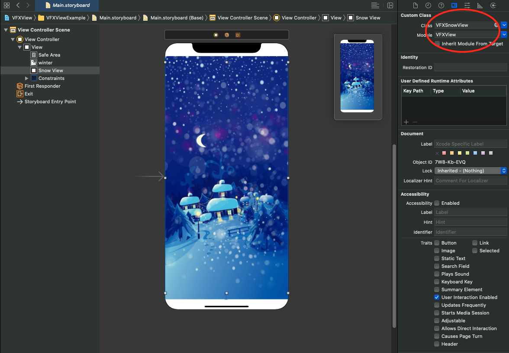

# FXView

`-` Version 0.3.0

`-` **VFXView** is a framework custom UIView by add some animation and effect.

# Table of contents
* [1 Installation](#Installation)
* [2 How To Use](#Setup)
* * [2.1 Initiation VFXView](#initiation)
* * [2.2 Start Animation for VFXView](#start_animation)
* * [2.3 Animation List](#animation_list)

## <a id="Installation"></a>1. Installation

### CocoaPods:

```ruby
use_frameworks!
target '<Your Target Name>' do
    pod 'VFXView'
end
```

### Manually

* Drag all files under `VFXView` folder into your project.

## <a id="Setup"></a>2. How To Use

### <a id="initiation"></a>2.1 Initiation VFXView

#### 2.1.1 By Code

`-` Objective-C:

```objC
VFXSnowView* snowView = [[VFXSnowView alloc] initWithFrame:containerView.frame];
```

`-` Swift:

```swift
var snowView = VFXSnowView.init(frame: containerView.frame)
```

#### 2.1.2 Use Interface Builder

1 Drag an VFXSnowView object to **ViewController** <br/>

2 Change the **Custom Class** to **VFXSnowView** <br/>

3 Add outlet to **VFXSnowView** <br/>

<p align="center">
  
</p>

### <a id="start_animation"></a>2.2 Start Animation for VFXView

#### 2.2.1 Run immediately

`-` Objective-C:

```objC
 [snowView setupVFXViewWithRect:containerView.frame];
```

`-` Swift:

```swift
snowView.setupVFXView(with: frame: containerView.frame)
```

#### 2.2.2 Run asynchronously

In case you want to load vfx configs from api server

`-` Objective-C:

```objC
 [snowView setupVFXViewWithRect:view.bounds andComplete:^(VFXView * _Nullable view) {
    // Do something
 }];
```

`-` Swift:

```swift
snowView.setupVFXView(with: view.bounds) { view in
  // Do something
}
```

`-` **Note** : You can use **VFXViewExample**, **VFXViewExampleObjc** to understand better

### <a id="animation_list"></a>2.3 Animation List

#### 2.3.1 VFXSnowView

With **VFXSnowView** you can create the snow fall effect on your view like bellow.

<p align="center">
  
</p>

#### 2.3.2 VFXMidnightSnowView

With **VFXMidnightSnowView** you can create the snow fall effect on your view like bellow.

<p align="center">
  
</p>

#### 2.3.3 VFXFlyBubbleView

With **VFXFlyBubbleView** you can create the snow fall effect on your view like bellow.

<p align="center">
  
</p>


#### 2.3.4 VFXRainView

With **VFXRainView** you can create the snow fall effect on your view like bellow.


<p align="center">
  
</p>

#### 2.3.5 VFXLiquidView

With **VFXLiquidView** you can create the snow fall effect on your view like bellow.


<p align="center">
  
</p>

#### 2.3.6 VFXBubblyView

With ** VFXBubblyView** you can create the snow fall effect on your view like bellow.

<p align="center">
  
</p>
